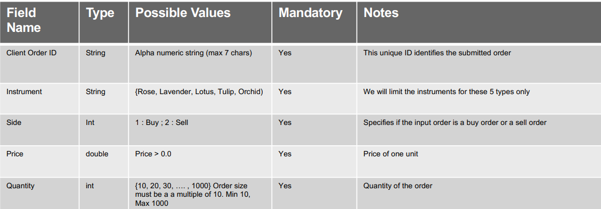
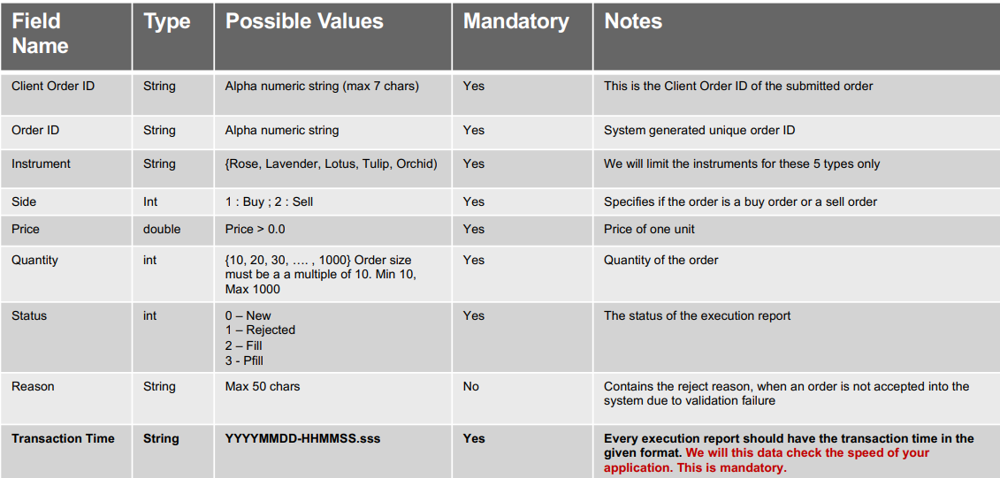

# C++ Flower Stock Exchange

A simple flower stock exchange system that accepts data from a csv file, then process it and output the trades to a new csv file.

## Input csv data

## Output csv data

## Execute

`g++ init.cpp -o init && init`

## Example

Enter the directory path to the input data csv file. 

**Enter input file path: data/data_0.csv**